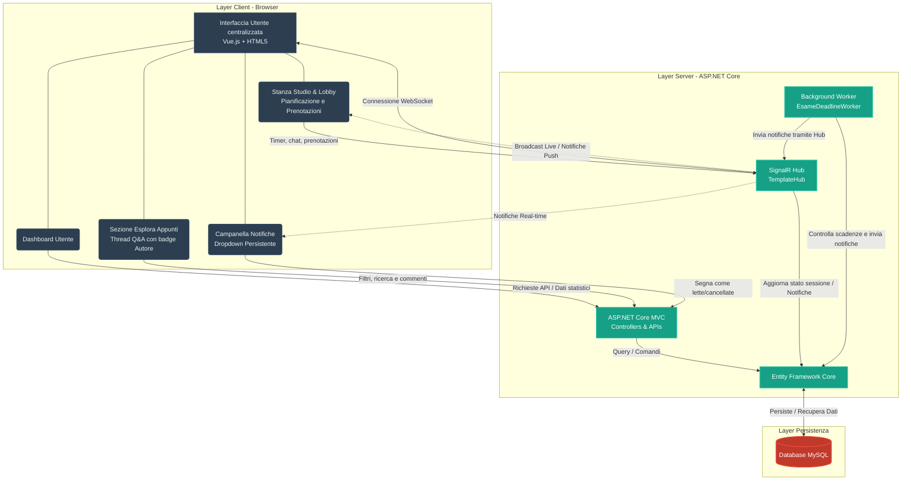

# StudySync: Piattaforma di Studio Collaborativo

[](#)
[](#)
[](#)
[](#)

## Partecipanti
**Gruppo**: StudySync

* **Matteo Aloè** - [matteo.aloe3@studio.unibo.it](mailto:matteo.aloe3@studio.unibo.it)
* **Elia Strazzella** - [elia.strazzella@studio.unibo.it](mailto:elia.strazzella@studio.unibo.it)

---

## Idea generale del progetto
StudySync è una piattaforma web pensata per facilitare lo studio collaborativo tra studenti universitari. L’applicazione consente di:
- Condividere appunti e risorse didattiche
- Gestire domande e risposte (Q&A) sui materiali condivisi con chiara distinzione tra autore e studenti
- Creare *Stanze Studio* in tempo reale con chat, timer Pomodoro sincronizzato e conteggio partecipanti
- Pianificare stanze future e prenotare i posti ricevendo notifiche automatiche prima dell'evento
- Pianificare il proprio calendario esami e organizzare sessioni di ripasso correlate
- Visualizzare statistiche personali mediante dashboard interattive

L’obiettivo è offrire un’esperienza fluida, reattiva e altamente coinvolgente, superando il classico approccio CRUD.

---

## Tecnologie principali
- **ASP.NET Core MVC** – Backend, gestione delle pagine server‑side ed API REST.
- **Entity Framework Core** – ORM per persistenza di utenti, corsi, appunti, notifiche, prenotazioni e sessioni.
- **SignalR** – Comunicazione bidirezionale in tempo reale per le *Stanze Studio* (chat, timer, utenti) e notifiche push globali.
- **Vue.js** – Frontend reattivo per filtri, ricerca, gestione stati locali e notifiche.
- **Bootstrap + CSS personalizzato** – Styling moderno, responsivo, curato e accessibile.

---

## Architettura del Sistema (Mermaid)


---

## Come avviare il progetto (modalità sviluppo)
```powershell
# Posizionarsi nella cartella del progetto
cd "c:/Users/matte/Desktop/Progetti Unibo/3 Anno/Laboratorio Uomo-Macchina/PROGETTO STUDIOSYNC/src/Template.Web"

# Ripristinare le dipendenze
dotnet restore

# Avviare il server con hot‑reload
dotnet watch run
```

Il frontend Vue.js è integrato direttamente nelle view Razor; non è necessario avviare un server separato.

---

## Funzionalità chiave
- **Stanze Studio Collaborative**: chat in tempo reale, timer Pomodoro sincronizzato, pianificazione di stanze future e sistema di prenotazione/booking con aggiornamento automatico dei partecipanti.
- **Esplora Appunti**: filtri per corso e tag, ricerca full‑text, download di materiale e sezione **Domande e Annotazioni (Q&A)** con evidenziazione grafica e badge dedicati per l'**Autore** e per le **Domande** degli altri utenti.
- **Pianificazione Esami**: un planner completo per organizzare gli esami imminenti con indicatori di priorità basati sulla vicinanza temporale e pianificazione di sessioni di ripasso mirate.
- **Sistema di Notifiche Real-time**: icona a campanella interattiva e persistente (con stato gestito in Vue per evitare conflitti) che aggiorna l'utente in tempo reale tramite SignalR per nuovi commenti sui propri appunti o promemoria delle stanze prenotate (1 giorno prima e all'avvio).
- **Dashboard Utente**: grafici interattivi e statistiche personalizzate sull'andamento delle ore di studio e degli esami superati.
- **Gestione Utenti**: sistema completo di registrazione, login e profili utente.
